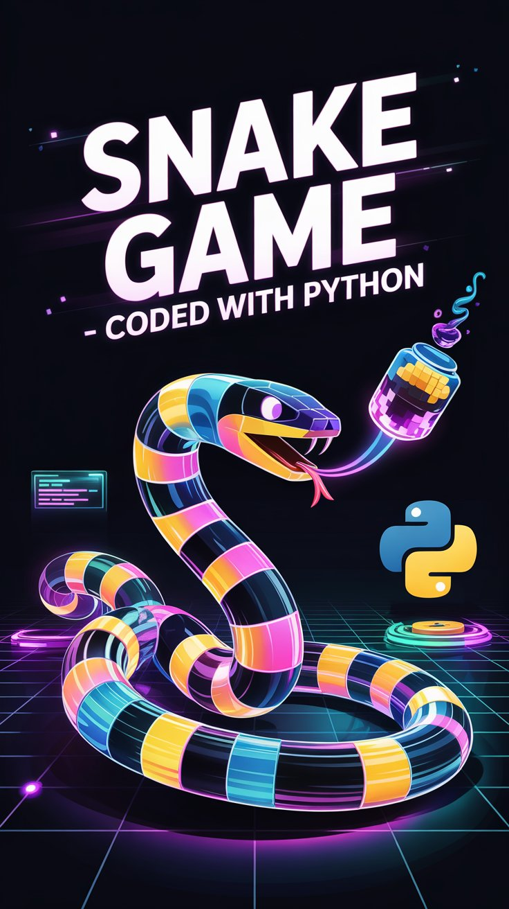

# Snake Game with Pygame

A fully functional clone of the classic Snake arcade game, developed using Python and the Pygame library. This project features a difficulty selection menu, a dynamic information bar, and a robust game loop.

## 🎮 Features

* **Difficulty Levels:** Choose between **Easy**, **Medium**, and **Hard** modes at the start. The difficulty setting adjusts the game speed (FPS).
* **Dynamic Info Bar:** A dedicated bottom panel displays the **Real-time Date/Clock** and the current **Score**.
* **Menu System:**
    * **Start Menu:** Select difficulty before playing.
    * **Game Over Menu:** Options to "Devam Et" (Continue/Restart) or "Bitir" (Quit) without closing the application.
* **Classic Mechanics:** Smooth movement, collision detection (walls and self), and score accumulation.
* **Retro Aesthetics:** Dark theme with high-contrast colors (Green Snake, Red Food).

## 🛠️ Technologies Used

* **Python 3.x**
* **Pygame** (Library for game development)
* **Datetime** (For real-time clock display)

## 📸 Concept Art



## ⚙️ Installation & How to Run

1.  **Clone the repository:**
    ```bash
    git clone [https://github.com/UgurSelimOkul/classic-snake-game-python.git](https://github.com/UgurSelimOkul/classic-snake-game-python.git)
    cd classic-snake-game-python
    ```

2.  **Install the required library:**
    You need `pygame` to run this game.
    ```bash
    pip install pygame
    ```

3.  **Run the game:**
    ```bash
    python main.py
    ```

## 🕹️ Controls

| Key | Action |
| :--- | :--- |
| **Arrow Keys** (⬆️⬇️⬅️➡️) | Move the Snake |
| **Enter** | Select Menu Option |
| **Up / Down** | Navigate Menus |

## 🧩 Code Structure

* **Grid System:** The game operates on a grid (`CELL_SIZE = 30`), ensuring perfect alignment of the snake and food.
* **Game Loop:** The main loop handles events, updates the snake's position, checks for collisions, and renders the graphics.
* **State Management:** The game handles different states (Menu, Playing, Game Over) seamlessly using nested loops.

---

### 👨‍💻 Author

**Uğur Selim Okul**
* [GitHub Profile](https://github.com/UgurSelimOkul)
